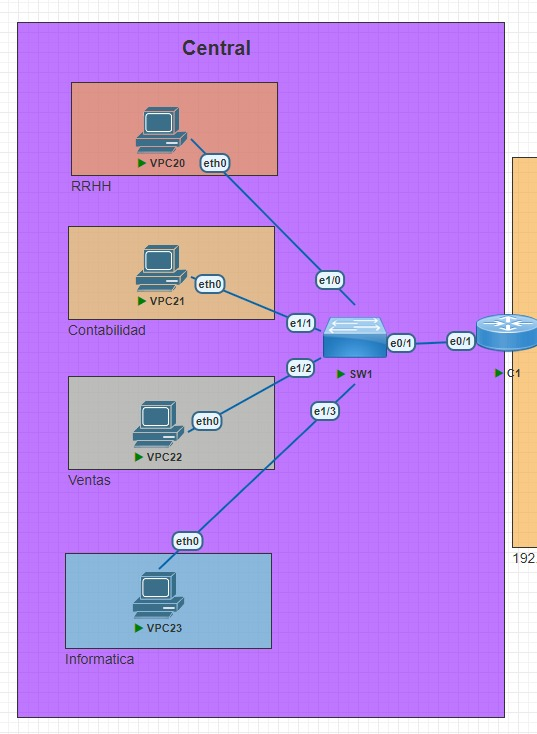
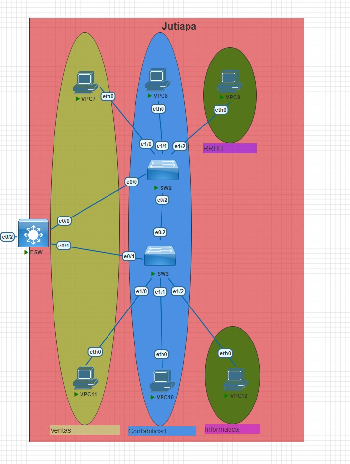
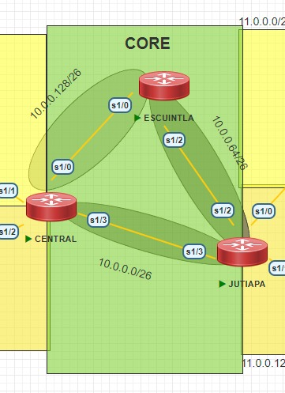
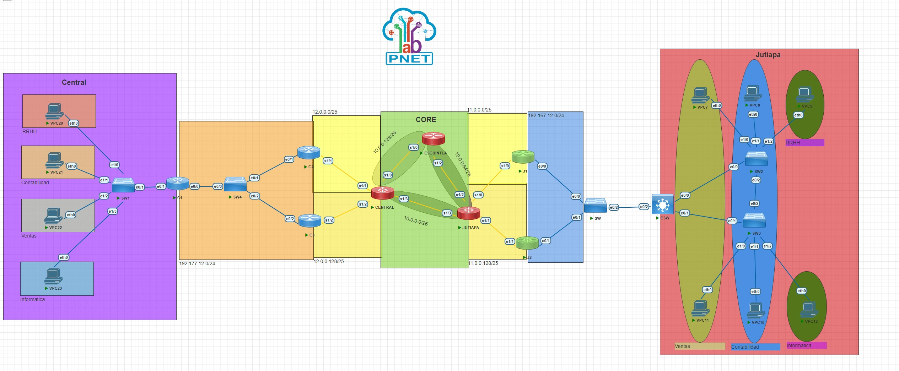
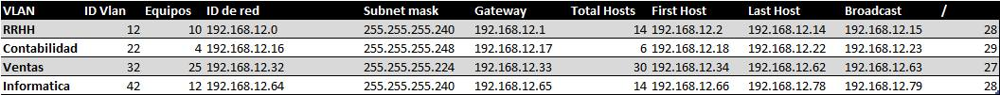
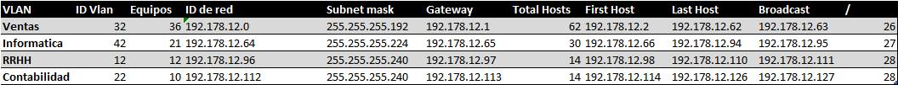

# Proyecto 2
## Central Network

## Jutiapa's Network

## Core Network

## Full network

## Ips y VLAN RED Jutiapa
Basado en los requerimientos de una subnetowork con VSLM se se escogió la primera red con subnet mask 28 para 14 hosts utilizables, y la segunda  subnet mask 29 para 6 hosts utilizables. La tercera subnet mask 27 para 30 con network id 192.168.12.32 lo que implica que desde el broadcast address de la anterior subnet se perdieron del ip 192.168.12.24 al 192.198.12.31, esto implica 8 ips que no pueden ser utilizados y esto se debe a la fragmentación, ya que un nuevo subnet block necesita que los bloques anteriores sean de igual o mayor tamaño que el bloque actual.

## Ips y VLAN RED Central
En esta red subnetwork se organizaron utilizando el VSLM, a modo de evitar fragmentación y perdida de ips, se organizaron las subnetworks ordenadas por el numero de hosts y de este modo no quedo ningún ip desperdiciado.

## Creacion y propagacion de vlans
**vlan VLAN_NUMBER:** Define el numero de una vlan.  
**vlan VLAN_NAME:** Define el nombre de una vlan.  
**show vlan brief: :** Muestra el estado de las vlans en el switch.  

## RSTP
**spanning-tree mode rapid-pvst:** Para setear los switches en RSTP.  
**show stp status:** Muestra el status actual del protocolo STP utilizado.  

## Rutas estaticas:
**ip route DEST_IP SUBNET_MASK NEXT_IP_THROUGH:** crea una ruta estatica en el router, definiendo el network id y subnet mask de donde queremos llegar, y el ip a travez del cual vamos a llegar.  
**show running-config | section ip route:** muestra los detalles de las rutas estaticas en el router. 

## Enrutamiento Dinamico

### HSRP
**standby 21 ip:** set the ip shared en ambos switches.  
**standby version VERSION_NUMBER:** set the version number en ambos switches.  
**standby 21 priority PRIORITY_NUMBER:** se usa en el switch que tendra la mayor prioridad, y sera el activo.
**standby 21 preemt:** Le permite al switch con mayor prioridad tomar la funcion de enrutamiento de HSRP.  
**show standby brief:** Muestra  un resumen de los grupos HSRP configurados en el dispositivo.  
### GLBP
**glbp 7 ip IP_SHARED:** set the ip shared en ambos switches.  
**glbp 7 preempt:** Le permite al switch con mayor prioridad tomar la funcion de enrutamiento de GLBP. 
**glbp 7 load-balancing round-robin:**configurar el protocolo GLBP para usar el algoritmo de balanceo de carga round-robin.  
**show glbp brief:** Muestra un resumen de las configuraciones GLBP.

**:**
**:**
**:**
**:**
**:**
**:**
**:**
**:**
**:**
**:**
**:**
**:**
**:**
**:**
**:**

